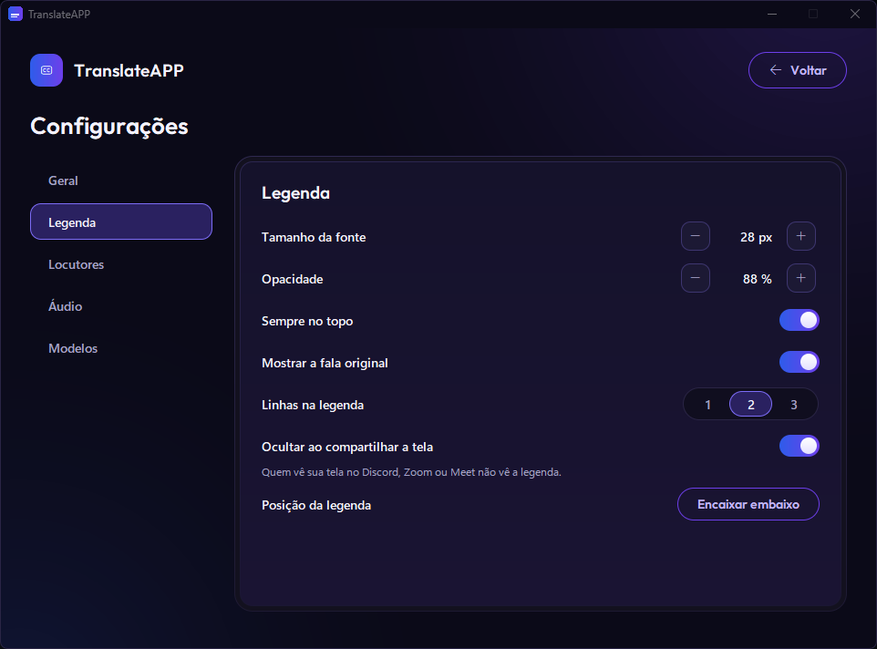

[Português](README.md) · **English**

# TranslateAPP

Live subtitles, translated between **English and Portuguese**, for the audio playing on your PC (a call on Discord, Zoom,
Meet, a video in your browser…), with each person labeled by name and color. Everything runs on your computer: once the
models are downloaded on first use, it works offline and no audio ever leaves your machine.


- [Download](#download)
- [Getting started](#getting-started)
- [Using the subtitles and the app](#using-the-subtitles-and-the-app)
- [Privacy and data](#privacy-and-data)
- [Troubleshooting](#troubleshooting)
- [For developers](#for-developers)
- [Credits and licenses](#credits-and-licenses)

## Download

**[Get `TranslateAPP-Setup.exe` from the latest release](https://github.com/loponte/TranslateAPP/releases/latest)** and run
it. It installs for your user only (no administrator rights needed) and adds a Start menu shortcut.

**Windows warning (SmartScreen):** the installer is not signed, so Windows may show "Windows protected your PC". Click
**More info** › **Run anyway**.

### Requirements

| | |
|---|---|
| System | Windows 10 version 2004 or newer, or Windows 11, 64-bit. Windows only for now. |
| Graphics card | NVIDIA **recommended**. Without one the app runs on the CPU (Parakeet model): it works, but subtitles are a bit slower and a bit less accurate. |
| Internet | Only on first use, to download the models. |
| Disk space | ~5 GB free with an NVIDIA GPU; ~2.5 GB without a GPU (includes temporary download space). |

### What gets downloaded on first use

The models are not in the installer. The first time you click **Start subtitles**, the app downloads what it needs and
shows the progress (on the subtitles and in the main window). After that everything stays saved on your computer.

| | With an NVIDIA GPU | Without a GPU |
|---|---|---|
| Speech recognition | Whisper large-v3-turbo, ~1.6 GB | Parakeet v3, ~490 MB |
| NVIDIA libraries (cuBLAS/cuDNN) | ~1.3 GB | — |
| English → Portuguese translator | ~860 MB | ~860 MB |
| Speaker separation | ~45 MB | ~45 MB |
| **Total** | **~3.8 GB** | **~1.4 GB** |

If you choose subtitles **in English**, the Portuguese → English translator (~280 MB) is downloaded the first time you
use it.

## Getting started

 

*(Screenshots show the Portuguese interface; the English one has the same layout.)*

1. **App language:** on first launch, pick **English** or **Português** and click **Continue**. A 4-step tutorial shows how
   everything works (you can **Skip** it and see it again under Settings › General › **Replay tutorial**).
2. **What to listen to** (card *01 · Audio*):
   - **One app**: listens only to the chosen app (Discord, Google Chrome, Zoom…); the rest of your PC's sound stays out.
     The list shows apps with sound (green dot = *playing*). If the app isn't there, play something in it and hit the
     refresh button.
   - **All audio**: listens to everything playing on an output device. *Windows default* follows the default output; or
     pick a specific headset or speaker.
3. **Languages** (card *02 · Languages*):
   - **Call language**: **Auto** (detects English or Portuguese sentence by sentence), **English** or **Portuguese**.
   - **Subtitles in**: **Portuguese** or **English**. Speech already in the subtitle language is shown as spoken.
4. Click **Start subtitles**. The main window hides and only the floating subtitles stay on screen.


From then on, the app starts subtitling on its own when you open it, with the last source and languages.

## Using the subtitles and the app


### Floating subtitles

Grey text is the partial (the sentence is still being heard); it turns white when the sentence ends. Below each line is
the original speech, in the language it was spoken (you can turn this off).

| Action | How |
|---|---|
| Move | Drag the middle of the subtitles |
| Resize | Pull any edge or corner |
| Snap to the bottom center of the screen | Double-click |
| Show the controls | Hover the mouse over it |
| Font size | **A−** / **A+** buttons, **Ctrl +** / **Ctrl −**, or Ctrl + mouse wheel |
| Opacity | Click the percentage button (cycles) or scroll the mouse wheel over it |
| Always on top | Pin button |
| Back to the main window | Open-main-window button or **Esc** (subtitles keep running) |
| Stop | Stop button (square) |
| More options | Right-click: **Show original speech**, **Always on top**, **Subtitle lines** (1 to 3), **Snap to bottom**, **View transcript**, **Save transcript (.txt)…**, **Save subtitles (.srt)…**, **Stop subtitles**, **Quit** |

Position, size and preferences are saved.

### Speakers

Each voice becomes **Speaker 1, 2, 3…**, with a fixed color. A new voice shows as **Speaker ?** until it has spoken for
about 3 seconds (so a stray "uh-huh" doesn't become an extra speaker).

- **Rename:** click the name on the subtitles (or right-click › **Rename…**). Renaming saves the voice on this computer, and
  the app recognizes it with the same name in your next calls.
- **Merge with:** the same person became two speakers? Right-click the name › **Merge with** › the other one. Lines already
  shown are fixed.
- **Forget voice:** right-click the name, or Settings › Speakers (**Forget** / **Forget all voices**).

### Changing source or language during a call

Open the main window (Esc on the subtitles), change what you want and click **Apply and go back**. The session restarts
without reloading the models, and saved voices are kept.

### Transcript

**View transcript** (in the main window or in the subtitles' right-click menu) opens the session history, with each
speaker's name. The **.txt** and **.srt** buttons save the text or a subtitle file; **Clear** erases the history.
Shortcuts: **Ctrl+S** saves as .txt, **Ctrl+L** clears. Scrolling up pauses auto-scroll; click the notice bar to jump
back to the end.

### Hide when sharing the screen

On by default: people watching your screen on Discord, Zoom or Meet don't see the subtitles (they don't show up in
screenshots either). To show them, turn off Settings › Subtitles › **Hide when sharing the screen**.

### Settings

Gear button in the main window (next to the **EN / PT** switch, which changes the app language right away).



- **General:** app language and **Replay tutorial**.
- **Subtitles:** font size, opacity, always on top, show original speech, subtitle lines (1 to 3), hide when sharing the
  screen and **Snap to bottom**.
- **Speakers:** saved voices (rename, forget, forget all).
- **Audio:** output device and whether per-app capture is available on this Windows.
- **Models:** model status and where they are (**Open folder**). Acceleration is picked automatically: an NVIDIA GPU if
  there is one, otherwise the CPU.

## Privacy and data

- **Nothing leaves your PC.** Transcription, translation and speaker separation run locally. The internet is only used to
  download the models on first use.
- **Voices:** a voice is biometric data. The app only stores a voice when you rename that speaker, keeps it on your
  computer only, and "Forget" deletes it.
- **Where the data lives:** `%LOCALAPPDATA%\TranslateAPP` (paste it into the Explorer address bar):
  - `models\` and `cuda\`: the downloaded models;
  - `settings.json`: your preferences and speaker names;
  - `speakers.json`: saved voices (only exists if you saved one);
  - `logs\app.log`: the diagnostic log (it doesn't store what people said).
- **The transcript** is only written to disk when you save a .txt or .srt.

### Uninstalling and cleaning up

1. Windows Settings › Apps › **TranslateAPP** › Uninstall.
2. Uninstalling doesn't delete the models or your preferences. To remove everything, delete the
   `%LOCALAPPDATA%\TranslateAPP` folder.

## Troubleshooting

**No subtitles show up**
- The app only listens while something is playing. Check that the call or video actually has sound.
- With **All audio**, the selected device has to be the one the sound really comes out of (headset, monitor and speakers
  are different outputs). The easiest fix is **One app** and picking Discord, your browser, etc.
- With **One app**: if it says the app isn't open and it's waiting, open the app; subtitles resume on their own.

**The app isn't in "Apps playing sound"**
- The list only shows apps with active or recent sound. Play something and hit refresh.
- Some apps play sound through another process and show up under that name (the new Teams shows as `msedgewebview2`).
- Per-app capture needs Windows 10 version 2004 or newer (Settings › Audio tells you whether it's available).

**Per-app capture failed**
- Windows refused to capture that app. Click **Use all audio**.

**Subtitles are slow or lagging**
- Without an NVIDIA GPU the app runs on the CPU, which is slower. With a GPU, make sure the NVIDIA driver is installed.
- Games, rendering or other heavy programs compete for the GPU and CPU; close them.
- If downloading the NVIDIA libraries fails, the app falls back to the CPU; it tries again the next time you open it.

**Stuck on "Downloading models" or "Loading models…", or a model error**
- First use needs internet and the free space listed above. Close and reopen the app: it only downloads what's missing.

**Wrong language on a short sentence**
- Short sentences inherit the person's previous language. If the whole call is in one language, pick it in **Call
  language** instead of **Auto**.

**Same person with two names / two people under one name**
- Two names: use **Merge with**. Poor call audio makes voices harder to tell apart.

**Sending the log to the developer**
- The file is `%LOCALAPPDATA%\TranslateAPP\logs\app.log`. It doesn't contain what people said, only errors and
  diagnostics.

Status and error messages that come from the speech engine are in Portuguese only for now.

## For developers

Run from source (Windows):

1. Once: right-click `setup.ps1` › *Run with PowerShell*
   (or `powershell -ExecutionPolicy Bypass -File .\setup.ps1`). It installs uv if missing, creates `.venv` with
   Python 3.12, installs `requirements.txt`, creates the `TranslateAPP.lnk` shortcut and downloads the models into
   `models\`.
2. Every time: double-click `run.bat` (or the shortcut). From source, data and logs live in the repository root
   (`logs\app.log`); to see everything in the terminal: `.venv\Scripts\python.exe -m app.main`.

Tests (same as CI):

```powershell
uv pip install --python .venv\Scripts\python.exe pytest
$env:PYTHONPATH = "."
.venv\Scripts\python.exe -m pytest -q tests\test_segmenter.py tests\test_pipeline.py
.venv\Scripts\python.exe -m app.ui --stress   # UI checks
.venv\Scripts\python.exe -m app.ui --demo     # UI with fake data (--first-run shows onboarding)
```

Building the installer: `scripts\build_win.ps1` (needs [Inno Setup](https://jrsoftware.org/isinfo.php)) produces
`dist\TranslateAPP-Setup.exe`. CI (`.github/workflows/build.yml`) does the same, runs `TranslateAPP.exe --selftest` on the
package and, on a `v*` tag, publishes the installer to a Release.

Architecture, module contracts, tuning and measurements (in Portuguese): [ARCHITECTURE.md](ARCHITECTURE.md).

## Credits and licenses

Models (downloaded on first use, not part of this repository):

- **Whisper large-v3-turbo** (OpenAI, MIT), running on [faster-whisper](https://github.com/SYSTRAN/faster-whisper) and
  [CTranslate2](https://github.com/OpenNMT/CTranslate2).
- **Parakeet-TDT-0.6B-v3** (NVIDIA, CC-BY-4.0), in the int8 build from [sherpa-onnx](https://github.com/k2-fsa/sherpa-onnx).
- **OPUS-MT** ([Helsinki-NLP / Tatoeba-MT](https://github.com/Helsinki-NLP/Tatoeba-Challenge), CC-BY-4.0): one model per
  direction, English → Portuguese (tc-big) and Portuguese → English. Source, license and attribution are in each model's
  folder (`models\mt-en-pt`, `models\mt-pt-en`: `info.json`, `LICENSE`, `README.md`).
- **Speakers:** TitaNet-small (NVIDIA NeMo) and pyannote segmentation-3.0, in the ONNX builds from sherpa-onnx.
- **Voice activity detection:** Silero VAD (shipped with faster-whisper).
- The speaker and voice-detection models are under their authors' own licenses.

Interface font: [Outfit](https://github.com/Outfitio/Outfit-Fonts), SIL Open Font License 1.1
([app/assets/OFL.txt](app/assets/OFL.txt)).
