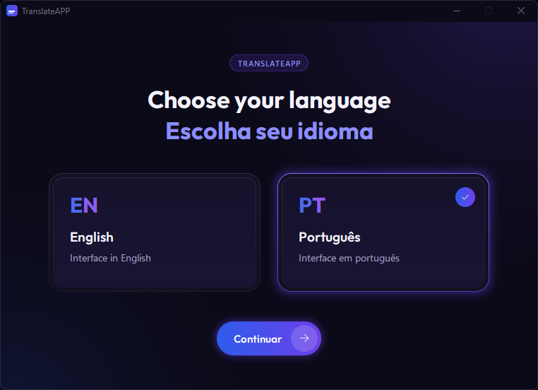
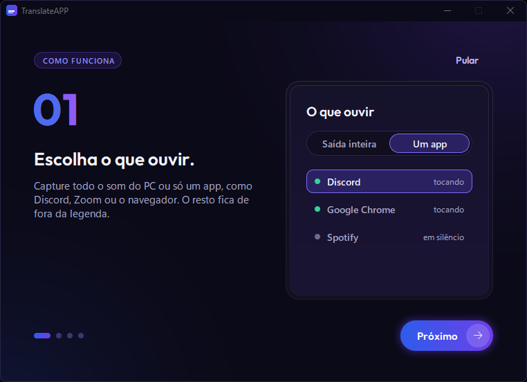

**Português** · [English](README.en.md)

# TranslateAPP

Legendas ao vivo, traduzidas entre **inglês e português**, para o áudio que toca no seu PC (uma call no Discord, Zoom,
Meet, um vídeo no navegador…), com cada pessoa identificada pelo nome e por uma cor. Tudo roda no seu computador: depois
de baixar os modelos no primeiro uso, funciona offline e nenhum áudio sai da máquina.


- [Download](#download)
- [Primeiros passos](#primeiros-passos)
- [Usando a legenda e o app](#usando-a-legenda-e-o-app)
- [Privacidade e dados](#privacidade-e-dados)
- [Problemas comuns](#problemas-comuns)
- [Para desenvolvedores](#para-desenvolvedores)
- [Créditos e licenças](#créditos-e-licenças)

## Download

**[Baixe o `TranslateAPP-Setup.exe` na última release](https://github.com/loponte/TranslateAPP/releases/latest)** e rode.
Ele instala só para o seu usuário (sem pedir administrador) e cria o atalho no menu Iniciar.

**Aviso do Windows (SmartScreen):** o instalador não é assinado, então o Windows pode mostrar "O Windows protegeu o
computador". Clique em **Mais informações** › **Executar assim mesmo**.

### Requisitos

| | |
|---|---|
| Sistema | Windows 10 versão 2004 ou mais novo, ou Windows 11, 64 bits. Só Windows por enquanto. |
| Placa de vídeo | NVIDIA **recomendada**. Sem ela o app roda no processador (modelo Parakeet): funciona, mas a legenda demora um pouco mais e erra um pouco mais. |
| Internet | Só no primeiro uso, para baixar os modelos. |
| Espaço em disco | ~5 GB livres com GPU NVIDIA; ~2,5 GB sem GPU (inclui o espaço temporário do download). |

### O que é baixado no primeiro uso

Os modelos não vêm no instalador. Na primeira vez que você clica em **Iniciar legenda**, o app baixa o que precisa e mostra
o progresso (na legenda e na janela principal). Depois disso fica tudo salvo no computador.

| | Com GPU NVIDIA | Sem GPU |
|---|---|---|
| Reconhecimento de fala | Whisper large-v3-turbo, ~1,6 GB | Parakeet v3, ~490 MB |
| Bibliotecas da NVIDIA (cuBLAS/cuDNN) | ~1,3 GB | — |
| Tradutor inglês → português | ~860 MB | ~860 MB |
| Separação de locutores | ~45 MB | ~45 MB |
| **Total** | **~3,8 GB** | **~1,4 GB** |

Se você escolher a legenda **em inglês**, o tradutor português → inglês (~280 MB) é baixado na primeira vez que usar.

## Primeiros passos

 

1. **Idioma do app:** na primeira abertura, escolha **English** ou **Português** e clique em **Continuar**. Um tutorial de
   4 passos mostra como tudo funciona (dá para **Pular** e rever depois em Configurações › Geral › **Rever tutorial**).
2. **O que ouvir** (card *01 · Áudio*):
   - **Um app**: escuta só o app escolhido (Discord, Google Chrome, Zoom…); o resto do som do PC fica de fora. A lista
     mostra os apps com som (ponto verde = *tocando*). Se o app não aparece, dê play nele e clique no botão de atualizar.
   - **Saída inteira**: escuta tudo o que toca num dispositivo de saída. *Padrão do Windows* acompanha a saída padrão;
     ou escolha um fone ou caixa específico.
3. **Idiomas** (card *02 · Idiomas*):
   - **Idioma da call**: **Auto** (detecta inglês ou português frase a frase), **English** ou **Português**.
   - **Legenda em**: **Português** ou **English**. Fala que já está no idioma da legenda aparece como foi dita.
4. Clique em **Iniciar legenda**. A janela principal some e fica só a legenda flutuante.


Nas próximas vezes, o app já começa a legendar sozinho ao abrir, com a última fonte e os últimos idiomas.

## Usando a legenda e o app


### Legenda flutuante

O texto cinza é a parcial (a frase ainda está sendo ouvida); ele fica branco quando a frase termina. Embaixo de cada fala
aparece a fala original, no idioma em que foi dita (dá para desligar).

| Ação | Como |
|---|---|
| Mover | Arraste pelo meio da legenda |
| Redimensionar | Puxe qualquer borda ou canto |
| Encaixar embaixo, no centro da tela | Duplo clique |
| Mostrar os controles | Passe o mouse por cima |
| Tamanho da fonte | Botões **A−** / **A+**, **Ctrl +** / **Ctrl −** ou Ctrl + roda do mouse |
| Opacidade | Clique no botão da porcentagem (alterna) ou gire a roda do mouse sobre ele |
| Sempre no topo | Botão do alfinete |
| Voltar à janela principal | Botão de abrir a janela principal ou **Esc** (a legenda continua rodando) |
| Parar | Botão de parar (quadrado) |
| Mais opções | Clique direito: **Mostrar a fala original**, **Sempre no topo**, **Linhas na legenda** (1 a 3), **Encaixar embaixo**, **Ver transcrição**, **Salvar transcrição (.txt)…**, **Salvar legenda (.srt)…**, **Parar legenda**, **Sair** |

A posição, o tamanho e as preferências ficam salvos.

### Locutores

Cada voz vira **Locutor 1, 2, 3…**, com uma cor fixa. Uma voz nova aparece como **Locutor ?** até falar uns 3 segundos
(assim um "aham" solto não vira um locutor a mais).

- **Renomear:** clique no nome na legenda (ou clique direito › **Renomear…**). Renomear salva a voz neste computador, e o
  app a reconhece com o mesmo nome nas próximas calls.
- **Juntar com:** a mesma pessoa virou dois locutores? Clique direito no nome › **Juntar com** › o outro. As linhas já
  mostradas são corrigidas.
- **Esquecer voz:** clique direito no nome, ou Configurações › Locutores (**Esquecer** / **Esquecer todas as vozes**).

### Trocar fonte ou idioma durante a call

Abra a janela principal (Esc na legenda), mude o que quiser e clique em **Aplicar e voltar**. A sessão reinicia sem
recarregar os modelos, e as vozes salvas continuam.

### Transcrição

**Ver transcrição** (na janela principal ou no clique direito da legenda) abre o histórico da sessão, com o nome de cada
locutor. Botões **.txt** e **.srt** salvam o texto ou um arquivo de legenda; **Limpar** apaga o histórico. Atalhos:
**Ctrl+S** salva em .txt, **Ctrl+L** limpa. Ao rolar para cima, a rolagem automática pausa; clique na faixa de aviso
para voltar ao fim.

### Ocultar ao compartilhar a tela

Vem ligado: quem vê sua tela no Discord, Zoom ou Meet não vê a legenda (ela também não aparece em prints). Para mostrar,
desligue em Configurações › Legenda › **Ocultar ao compartilhar a tela**.

### Configurações

Botão da engrenagem na janela principal (ao lado do seletor **EN / PT**, que troca o idioma do app na hora).

- **Geral:** idioma do app e **Rever tutorial**.
- **Legenda:** tamanho da fonte, opacidade, sempre no topo, mostrar a fala original, linhas na legenda (1 a 3), ocultar
  ao compartilhar a tela e **Encaixar embaixo**.
- **Locutores:** as vozes salvas (renomear, esquecer, esquecer todas).
- **Áudio:** dispositivo de saída e se a captura por app está disponível neste Windows.
- **Modelos:** estado dos modelos, onde estão (**Abrir pasta**). A aceleração é escolhida sozinha: GPU NVIDIA se houver,
  senão o processador.

## Privacidade e dados

- **Nada sai do seu PC.** Transcrição, tradução e separação de locutores rodam localmente. A internet só é usada para
  baixar os modelos no primeiro uso.
- **Vozes:** voz é dado biométrico. O app só guarda uma voz quando você renomeia o locutor, guarda só no computador e
  "Esquecer" apaga.
- **Onde ficam os dados:** `%LOCALAPPDATA%\TranslateAPP` (cole na barra de endereço do Explorer):
  - `models\` e `cuda\`: os modelos baixados;
  - `settings.json`: suas preferências e nomes dos locutores;
  - `speakers.json`: as vozes salvas (só existe se você salvou alguma);
  - `logs\app.log`: o log de diagnóstico (não guarda o texto das falas).
- **A transcrição** só vai para o disco quando você salva um .txt ou .srt.

### Desinstalar e limpar

1. Configurações do Windows › Aplicativos › **TranslateAPP** › Desinstalar.
2. A desinstalação não apaga os modelos nem as preferências. Para remover tudo, apague a pasta
   `%LOCALAPPDATA%\TranslateAPP`.

## Problemas comuns

**Não aparece legenda nenhuma**
- O app só escuta enquanto algo toca. Confira se a call ou o vídeo está com som.
- Com **Saída inteira**, o dispositivo escolhido precisa ser aquele por onde o som sai de fato (fone, monitor e caixas são
  saídas diferentes). O mais simples é usar **Um app** e escolher o Discord, o navegador etc.
- Com **Um app**: se aparece "*app* não está aberto — esperando…", abra o app; a legenda volta sozinha.

**O app não está na lista de "Apps tocando som"**
- A lista só mostra quem tem som ativo ou recente. Dê play e clique em atualizar.
- Alguns apps tocam o som por outro processo e aparecem com esse nome (o Teams novo aparece como `msedgewebview2`).
- A captura por app precisa do Windows 10 versão 2004 ou mais novo (Configurações › Áudio diz se está disponível).

**"Falha na captura por app"**
- O Windows recusou capturar aquele app. Clique em **Usar a saída inteira**.

**A legenda está lenta ou atrasada**
- Sem GPU NVIDIA o app roda no processador: é mais lento. Com GPU, confira se o driver da NVIDIA está instalado.
- Jogos, renderização ou outros programas pesados disputam a GPU e o processador; feche-os.
- Se o download das bibliotecas da NVIDIA falhar, o app usa o processador; ele tenta baixar de novo na próxima vez
  que abrir.

**Fica em "Baixando modelos" ou "Carregando modelos…", ou dá erro de modelo**
- O primeiro uso precisa de internet e do espaço livre da tabela acima. Feche e abra o app de novo: ele baixa
  de novo só o que faltou.

**O idioma saiu errado numa frase curta**
- Frases curtas herdam o idioma anterior da pessoa. Se a call é toda num idioma, escolha-o em **Idioma da call** em vez
  de **Auto**.

**A mesma pessoa aparece com dois nomes / duas pessoas com um nome só**
- Dois nomes: use **Juntar com**. Áudio de call ruim separa pior as vozes.

**Mandar o log para o desenvolvedor**
- O arquivo é `%LOCALAPPDATA%\TranslateAPP\logs\app.log`. Ele não contém o texto das falas, só os erros e o diagnóstico.

## Para desenvolvedores

Rodar do código (Windows):

1. Uma vez: clique direito em `setup.ps1` › *Executar com o PowerShell*
   (ou `powershell -ExecutionPolicy Bypass -File .\setup.ps1`). Instala o uv se faltar, cria o `.venv` com Python 3.12,
   instala o `requirements.txt`, cria o atalho `TranslateAPP.lnk` e baixa os modelos para `models\`.
2. Sempre: duplo clique em `run.bat` (ou no atalho). Rodando do código, dados e logs ficam na raiz do repositório
   (`logs\app.log`); para ver tudo no terminal: `.venv\Scripts\python.exe -m app.main`.

Testes (como no CI):

```powershell
uv pip install --python .venv\Scripts\python.exe pytest
$env:PYTHONPATH = "."
.venv\Scripts\python.exe -m pytest -q tests\test_segmenter.py tests\test_pipeline.py
.venv\Scripts\python.exe -m app.ui --stress   # checagens da interface
.venv\Scripts\python.exe -m app.ui --demo     # interface com dados falsos (--first-run mostra o onboarding)
```

Build do instalador: `scripts\build_win.ps1` (precisa do [Inno Setup](https://jrsoftware.org/isinfo.php)) gera
`dist\TranslateAPP-Setup.exe`. O CI (`.github/workflows/build.yml`) faz o mesmo, roda `TranslateAPP.exe --selftest` no
pacote e, numa tag `v*`, publica o instalador numa Release.

Arquitetura, contratos entre módulos, calibração e medições: [ARCHITECTURE.md](ARCHITECTURE.md).

## Créditos e licenças

Modelos (baixados no primeiro uso, não fazem parte deste repositório):

- **Whisper large-v3-turbo** (OpenAI, MIT), rodando com [faster-whisper](https://github.com/SYSTRAN/faster-whisper) e
  [CTranslate2](https://github.com/OpenNMT/CTranslate2).
- **Parakeet-TDT-0.6B-v3** (NVIDIA, CC-BY-4.0), na versão int8 do [sherpa-onnx](https://github.com/k2-fsa/sherpa-onnx).
- **OPUS-MT** ([Helsinki-NLP / Tatoeba-MT](https://github.com/Helsinki-NLP/Tatoeba-Challenge), CC-BY-4.0): um modelo por
  direção, inglês → português (tc-big) e português → inglês. Origem, licença e atribuição ficam na pasta de cada modelo
  (`models\mt-en-pt`, `models\mt-pt-en`: `info.json`, `LICENSE`, `README.md`).
- **Locutores:** TitaNet-small (NVIDIA NeMo) e pyannote segmentation-3.0, nas versões ONNX do sherpa-onnx.
- **Detecção de voz:** Silero VAD (distribuído com o faster-whisper).
- Os modelos de locutores e de detecção de voz seguem as licenças dos próprios autores.

Fonte da interface: [Outfit](https://github.com/Outfitio/Outfit-Fonts), SIL Open Font License 1.1
([app/assets/OFL.txt](app/assets/OFL.txt)).
