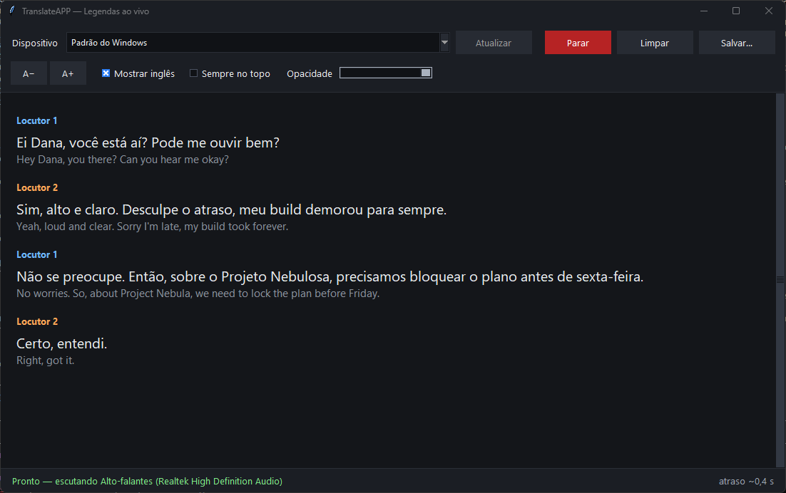
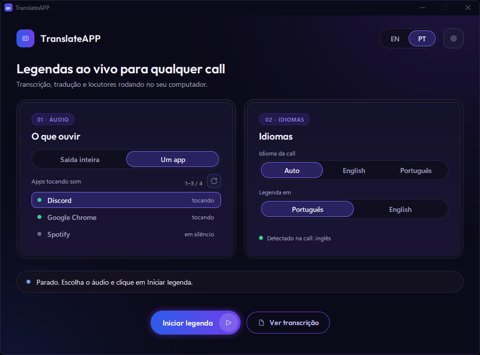
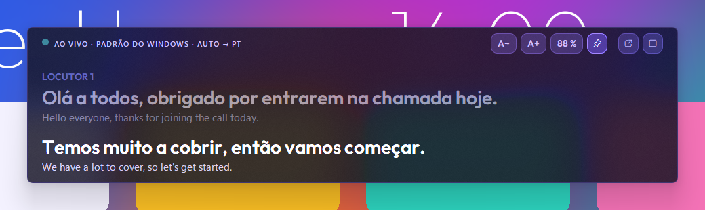

# TranslateAPP — legendas ao vivo do áudio do PC, em português ou inglês

Escuta o que sai do PC (o som inteiro ou só um app: Discord, Meet, Teams, Zoom, o navegador…), transcreve a fala em
**inglês ou português** (o idioma é detectado sozinho), separa por **locutor** e mostra a legenda numa janela flutuante
estilo cinema, em **português do Brasil** ou em **inglês**. Tudo roda local: nenhum áudio sai do computador.

Com GPU NVIDIA, a legenda definitiva sai ~0,45 s depois de a frase terminar (até ~0,65 s quando a frase troca de locutor),
e a parcial, em cinza, ~0,14 s depois do áudio que ela cobre.

> Modelos locais: transcrição com o **Whisper large-v3-turbo** (OpenAI, MIT) na GPU ou o **Parakeet-TDT-0.6B-v3**
> (NVIDIA, CC-BY-4.0) na CPU; tradução com o **OPUS-MT** (Helsinki-NLP, CC-BY-4.0), um modelo por direção
> (EN → PT-BR em `models\mt-en-pt`, PT → EN em `models\mt-pt-en`; origem, licença e atribuição ficam em cada pasta:
> `info.json`, `LICENSE`, `README.md`). Locutores e VAD têm as licenças dos próprios autores.

## Baixar pronto (sem instalar Python)
Na página de **Releases** do GitHub há o `TranslateAPP-Setup.exe` (gerado pelo Actions). Os modelos **não** vêm no pacote:
na 1ª abertura o app baixa o que precisa para a pasta de dados (`%LOCALAPPDATA%\TranslateAPP`) e mostra o progresso
(reconhecimento de fala ~1,6 GB na GPU ou ~490 MB na CPU, tradutor ~860 MB, +~280 MB só se a legenda for em inglês, locutores ~45 MB). Logs em `logs\app.log` dessa
pasta.
- **Windows (.exe):** baixe e rode `TranslateAPP-Setup.exe` (instala por usuário, sem admin). Com GPU NVIDIA, o app baixa
  também cuBLAS/cuDNN (~1,3 GB) na 1ª vez; sem GPU (ou se falhar) roda na CPU com o Parakeet.
- **macOS:** saiu por enquanto (o app é só Windows a partir da v0.3.0; o código do Mac está no histórico do
  git, tag `v0.2.1`).
- **Gerar você mesmo:** `scripts\build_win.ps1` (precisa do Inno Setup) → `dist\TranslateAPP-Setup.exe`. O CI
  (`.github/workflows/build.yml`) faz o mesmo, roda `TranslateAPP --selftest` no binário e, numa tag `v*`, anexa o `.exe` a
  uma Release.

## Instalar e rodar (a partir do código, Windows)
1. **Uma vez:** botão direito em `setup.ps1` → *Executar com o PowerShell* (ou `powershell -ExecutionPolicy Bypass -File .\setup.ps1`).
   Cria o `.venv` (Python 3.12 via uv), instala o `requirements.txt`, cria o atalho `TranslateAPP.lnk` e baixa os modelos para
   `models\` (Whisper large-v3-turbo, Parakeet v3, locutores, VAD, tradução EN → PT e, se der, PT → EN). Pode repetir à
   vontade: só completa o que falta.
2. **Sempre:** duplo clique em `TranslateAPP.lnk` ou em `run.bat`. A janela abre sem console; erros e diagnóstico ficam em
   `logs\app.log` (para ver tudo no terminal: `.venv\Scripts\python.exe -m app.main`).
3. **1ª abertura:** escolha o idioma do app (português ou inglês) e veja o tutorial de 4 passos (dá para pular e rever em
   Configurações › Geral). Depois disso o app já começa a legendar ao abrir, com a última fonte e os últimos idiomas
   (`AUTOSTART = True` em `app\main.py`; com `False` ele espera o clique em **Iniciar legenda**).

## Usar

- **01 · Áudio:**
  - **Saída inteira** escuta tudo o que toca num dispositivo de saída. *Padrão do Windows* acompanha a saída padrão (se ela
    mudar, a captura reabre sozinha); escolher um nome fixa aquela saída. O botão de atualizar relê a lista (fone novo, por exemplo).
  - **Um app** escuta só o app escolhido (e os processos filhos dele): o resto do som do PC fica de fora. A lista mostra os
    apps com sessão de áudio (ponto verde = tocando agora); se o app não aparece, dê play nele e clique em atualizar. O app
    fica salvo pelo nome do exe: se ele fechar, a legenda espera ("Discord não está aberto — esperando…") e volta sozinha
    quando ele reabrir. Precisa do Windows 10 versão 2004 ou mais novo.
- **02 · Idiomas:**
  - **Idioma da call:** *Auto* detecta inglês ou português frase a frase (fala curta ou indecisa herda o idioma anterior do
    mesmo locutor); *English* ou *Português* fixa o idioma (sem detecção). "Detectado na call" mostra o idioma da última frase.
  - **Legenda em:** português ou inglês. Fala que já está no idioma da legenda aparece como foi dita, sem tradução.
- **Iniciar legenda** esconde a janela principal e abre a **legenda flutuante**. **Ver transcrição** abre o histórico
  (salvar em `.txt` ou `.srt`, limpar). Trocar fonte ou idioma com a legenda rodando: abra a principal (⟲ na legenda) e
  clique em **Aplicar e voltar** (a sessão reinicia; os modelos e as vozes salvas continuam).

- **Legenda flutuante:** arraste pelo meio para mover, puxe qualquer borda ou canto para redimensionar; duplo clique encaixa
  embaixo, no centro da tela. Os controles aparecem ao passar o mouse: **A− / A+** (fonte, também Ctrl − / Ctrl +),
  opacidade (clique alterna, a roda do mouse ajusta), sempre no topo, ⟲ (abre a principal, a legenda continua) e ■ (para tudo).
  **Esc** volta à principal. O texto cinza é a parcial (ainda sendo ouvida); vira definitivo quando a frase termina, e a fala
  anterior sobe e esmaece. A posição e o tamanho ficam salvos.
- **Ocultar ao compartilhar a tela** (ligado por padrão no Windows): quem vê sua tela no Discord, Zoom ou Meet não vê a legenda
  (ela também não sai em prints). Desligue em Configurações › Legenda se quiser mostrar.
- **Configurações** (engrenagem): Geral (idioma do app, rever tutorial), Legenda (fonte, opacidade, sempre no topo,
  fala original, 1 a 3 linhas, ocultar ao compartilhar, encaixar), Locutores, Áudio e Modelos (pasta dos modelos).
  Tudo fica em `settings.json`.

## Locutores
Cada voz vira "Locutor 1, 2, …" na ordem em que é confirmada, com uma cor fixa. Uma voz nova aparece como **Locutor ?** até
somar ~3 s de fala: assim um ruído ou um "aham" solto não vira um locutor fantasma. Quando outra pessoa começa a falar logo
depois da primeira (pausa menor que o silêncio de fim de frase, 0,45 s), o app acha a troca de voz e cada trecho vira uma linha.
- **Renomear:** clique no nome na legenda (ou botão direito › Renomear). Renomear **salva a voz** neste computador, para
  reconhecê-la com o mesmo nome nas próximas calls, já na 1ª frase.
- **Juntar com ▸** (botão direito): a mesma pessoa virou dois locutores? Junte um no outro; as linhas já mostradas são corrigidas.
- **Esquecer voz** (botão direito) ou Configurações › Locutores › **Esquecer todas as vozes**.
- Voz é dado biométrico (LGPD): as vozes só são salvas quando você renomeia, ficam só no computador (`speakers.json`) e
  "Esquecer" apaga.

## Calibrar
Três dicionários no topo de `app\main.py`, vazios = padrão do módulo. Preencha, salve e reabra o app.
- **Silêncio de fim de frase** — `SEG_KW = {"end_silence_ms": 350}` (padrão 450 ms; `end_silence_long_ms`, padrão 250 ms,
  vale depois de 6 s de fala). Quanto menor, mais rápido a frase fecha, mas pausas curtas passam a cortar frases em duas.
- **Limiar de locutor** — `DIAR_KW = {"threshold": 0.45}` (padrão **0,40**, calibrado para o TitaNet-small; similaridade
  mínima para ser "a mesma pessoa"). Mesma pessoa virando dois locutores → **baixe**; duas pessoas viraram uma → **suba**.
  Mexa de 0,05 em 0,05. `"confirm_s": 3.0` é quanto de fala uma voz nova precisa para ganhar número. Voz de call
  (Discord/Opus, microfone ruim) separa menos que o áudio de teste; para isso, "Juntar com" resolve na hora.
- **Reconhecimento de fala** — `ASR_KW = {"model": "parakeet-v3"}` usa o Parakeet (CPU) mesmo com GPU; padrão na GPU:
  `large-v3-turbo` (float16).
- **Medir** — `tests\e2e_report.py` reproduz os áudios de teste em tempo real pelo app inteiro (sem tocar som) e mostra
  acurácia de locutor, erro de transcrição (WER), acerto de idioma e atrasos. `--call-lang auto|en|pt` e `--sub-lang pt|en`
  escolhem os idiomas (ex.: `conv_pt_2spk --sub-lang en`, ou `misto` para inglês seguido de português); `--kw diar.threshold=0.35`
  (ou `seg.…`, `asr.…`) testa uma calibração sem editar nada; `--fast` faz uma varredura rápida (sem atrasos) e `--secs 30` só
  os primeiros 30 s. Atrasos reais por frase em `logs\latency.csv` (`utt_id,dur_s,asr_ms,spk_ms,mt_ms,lag_ms`; `lag_ms` = fim do
  áudio → legenda pronta, ±16 ms): `Import-Csv logs\latency.csv | Measure-Object lag_ms -Average -Maximum`.

## Problemas
- **Nada aparece:** o app só escuta *enquanto algo toca*. Com **Saída inteira**, confira se o dispositivo escolhido é aquele
  por onde o som realmente sai (fone ≠ monitor ≠ caixas); o mais simples é usar **Um app** e escolher o Discord, o navegador etc.
- **O app não está na lista:** a lista só mostra quem tem som ativo ou recente. Dê play e clique em atualizar. Apps que tocam
  por outro processo (o Teams novo toca pelo `msedgewebview2.exe`) aparecem com o nome desse processo.
- **"Falha na captura por app":** o Windows recusou capturar aquele app; clique em **Usar a saída inteira**.
- **Fica em "Carregando modelos…" ou dá erro de modelo:** rode `setup.ps1` de novo (precisa de internet na 1ª vez) e veja
  `logs\app.log`.
- **Legenda atrasada:** GPU ou CPU ocupada por outro programa (jogo, render) — feche-o. Sem GPU NVIDIA o app usa o Parakeet na
  CPU (parcial ~0,2–0,6 s, erra um pouco mais). Se o atraso é quase sempre ~0,5 s, é o silêncio de fim de frase (acima).
- **Idioma errado numa frase curta:** frases com menos de 1,5 s herdam o idioma anterior do locutor. Se a call é toda num
  idioma, fixe-o em *Idioma da call* (também economiza a detecção).
- **Locutores trocados:** a mesma pessoa com 2 rótulos → **Juntar com** (ou baixe o `threshold`); duas pessoas num rótulo só →
  suba. "Locutor ?" = voz nova com menos de ~3 s de fala, ou trecho curto demais para reconhecer.
